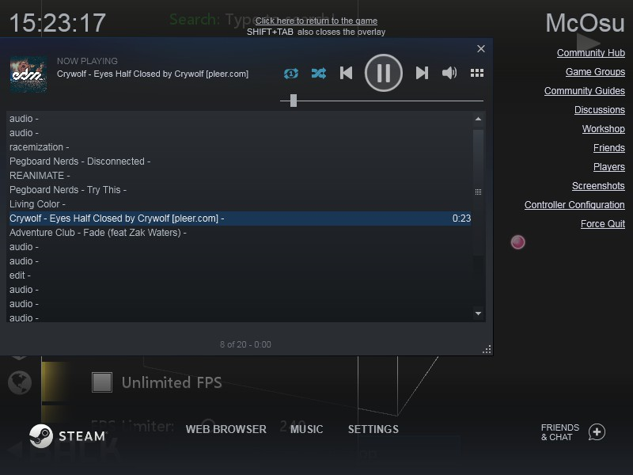

# osuplaylist
  
- Extract all osu songs, collection,run a regex search in .osu tag line , apply daterange 
- Export audio to directory/to ingame collection/to steam queue or create m3u8 playlist
- Import your songs in .mp3 format to osu
- Use as a module  

# Installation 
Python version >= 3.6  
`pip install osuplaylist`  
update `pip install osuplaylist -U`
# Limitations
- creation of ingame collection requires to restart client
- importing your mp3 requires restart & refresh `F5` & ascii name
- daterange will not work properly  on linux
## Commands
### export all songs as .m3u8 playlist, may take a while
  `osuplaylist`
### apply daterange (optional)
  `osuplaylist --date_range "daterange"`,daterange format:Year.month.day example: >2020.1.1 older than, 2020.1.1:2020.1.24 in this range 
### export collection. Name might be case insensitive or with typos 
 `osuplaylist --collection "name of collection"`
### export to ingame collection. Name will be with current timestamp. (optional)
 `osuplaylist --update_db "name of collection"` 
### run a regex search on tags provided from .osu file 
`osuplaylist --regtag "regex"`
### run an inversed regex search on tags (optional)
  `osuplaylist -r "regex" -i ` 
###  provide path to export audio.(optional) if used without arg - all songs
  `osuplaylist --to_dir "path"`
### export to steam queue.m3u8 
 `osuplaylist -r "step" -s` close steam first, this will overwrite queue.m3u8 from _database of steam, you will be asked just one time to provide full path 
### import mp3s 
   `osuplaylist -m "E:Installation\music" -n "in_game_collection_name"`, name _ascii only_  and you need manually click all mp3s, search mp3 in osu,and click,otherwise collections will not work
### info
 `osuplaylist --help` 

## Examples 
### Example  with [mpv](https://mpv.io/):
  `mpv --playlist=playlist.m3u8 --shuffle --volume 35` 
### Example regex search + inverse + to directory:
 `osuplaylist -r "(azer|step)" -i -d "E:/music/osuplaylist"`
`-r "(azer|step)"` will match all songs which contain azer or step

`-i` (optional) return an inverted result , all songs which NOT contain azer or step

`-d` (optional) export .mp3 to directory E:/music/osuplaylist
### Example combine regex + daterange + to steam
`osuplaylist -r "stea" -t ">2020.1.1" -s`
# Using osuplaylist.py as a library
```python
import osuplaylist
from osuplaylist import osudict, names, namedict

print(len(names))
# this will filter taglines matching azer or step 
first_search = osuplaylist.filter_tags(osudict, regtag="(azer|step") 
print(first_search)
# this will filter taglines from first_search matching drumstep 
second_search = osuplaylist.filter_tags(
    osudict, regtag="drumstep", list_of_song_names=first_search
)
print(second_search)
# export to dir
osuplaylist.export_to_dir(second_search)
```
# Contribute
Create issue with bug or feature requests .
Pull requests regarding things which aren't directly related to the program will not be merged.
For example, pull requests related to README.md will not be merged, you can open an issue instead.
# See also 
- https://github.com/osufiles/osu-bgchanger - A simple tool for automatically changing all your osu! beatmap backgrounds to a custom one .
- https://github.com/upgradeQ/OSU-STREAM-DETECTOR - osu standard stream map identifier & exporter to ingame collection .
